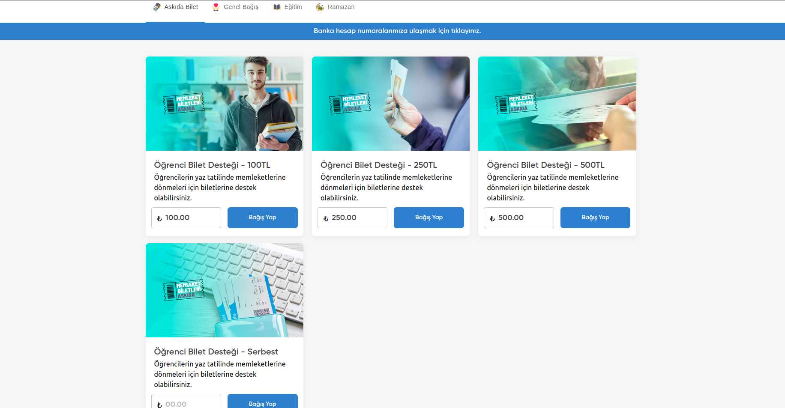

[](https://github.com/mebaysan/donation-app/actions/workflows/ci.yaml)[](https://github.com/mebaysan/donation-app/actions/workflows/ci-develop.yaml)

# Table of Contents

- [Table of Contents](#table-of-contents)
- [Introducing the Donation App - Empowering Non-Profits](#introducing-the-donation-app---empowering-non-profits)
- [Core Django Settings](#core-django-settings)
- [For Development](#for-development)
- [Backup](#backup)
- [Codebase Related Topic](#codebase-related-topic)
    - [Static \& Media Files for Production](#static--media-files-for-production)
    - [Custom Authentication Backend](#custom-authentication-backend)
- [Development Environment](#development-environment)
    - [Run Project](#run-project)
    - [Test Project](#test-project)
- [Environment Variables](#environment-variables)

# Introducing the Donation App - Empowering Non-Profits

Welcome to the Donation App, a testament to the power of open-source collaboration. This project has its roots in a
dream – a dream of developing a Software as a Service (SaaS) solution tailor-made for non-profit organizations. However,
through interactions with various charitable entities, it became evident that many sought a more personalized approach.
Concerns over data privacy, varying donation volumes, and the desire for local financial autonomy led me to rethink my
approach. Thus, I embarked on a journey to create a versatile, multi-instance backend that empowers organizations to set
up their own donation infrastructure within their preferred systems, be it on a hybrid cloud, private cloud, or other
solutions. The result? A cost-effective and customizable platform that allows non-profits to receive donations directly
via local banks, reducing their reliance on third-party payment providers. I am excited to share this project with the
volunteers who are passionate to work for non-profits and invite you to explore, contribute, and make it even better.
Together, let's make a positive impact! Explore the code and contribute
on [GitHub](https://github.com/mebaysan/donation-app).

You can access the Docker image from [Docker Hub](https://hub.docker.com/r/mebaysan/donation-app).


*Image above is example of one of the pre-built apps that are used this project. In the future, the frontend repository
will be open-source.

# For Development

You can use [dev-postgres.sh](scripts/dev-postgres.sh) to create a development database.

# Backup

You can use [backuper-db.sh](scripts/backuper-db.sh) to backup your database inside Docker container.

You can use [backuper-web.sh](scripts/backuper-web.sh) to backup your django data inside Docker container.

You can create a crontab by using the command below.

```
sudo crontab -e
```

# Codebase Related Topic

## Static & Media Files for Production

```bash
STATIC_URL = "/django-static/" # for proxy purposes

MEDIA_URL = "/django-media/" # for proxy purposes
```

## Custom Authentication Backend

For this app, **we can be logged in via username or phone_number**. Application
uses [`apps.management.authentication.JWTAuthentication`](./src/apps/management/authentication.py) class for rest
framework views.

To obtain a token, we use `/api/token/` endpoint. It uses [`ObtainTokenView`](./src/apps/management/api/views.py) view.

## API Endpoints

You can easily import Postman collection from [here](./postman/BaysanSoft-Donation-App.postman_collection.json).

Also you can check `/api/docs` endpoint for API documentation.

# Development Environment

## Run Project

To override the config variables, you can update the variables in [`src/.env.dev`](./src/.env.dev) file.

```bash
mv src/.env.dev src/.env # create .env file
make install # install the requirements
make create-devdb # create project dev db (you have to have Docker on your machine)
make migration # create the db
make load_countries_states # load country and state_provinces data
make superuser # create a super user 
make runserver # run the project
```

## Test Project

```bash
make install # install the requirements
make format # format the code
make lint # lint the code
make test # run the tests
```

# Environment Variables

You can check [`.env.dev`](./src/.env.dev) file to see the environment variables. All environment variables are have to
be provided in production environment.

# Docker

You can access the Docker image from [Docker Hub](https://hub.docker.com/r/mebaysan/donation-app).

```bash
docker image pull mebaysan/donation-app:latest # pull the latest image
docker image pull mebaysan/donation-app:develop # pull the develop image
```