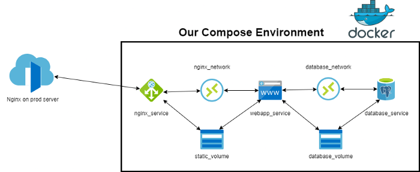

[](https://github.com/mebaysan/donation-app/actions/workflows/ci.yaml)

# Table of Contents

- [Table of Contents](#table-of-contents)
- [Introduction](#introduction)
- [Makefile](#makefile)
- [Django App Dockerfile](#django-app-dockerfile)
- [Nginx Dockerfile](#nginx-dockerfile)
- [Docker Compose](#docker-compose)
- [Core Django Settings](#core-django-settings)
- [For Development](#for-development)
- [For Production](#for-production)
  - [Load Default Superuser](#load-default-superuser)
- [Default Credentials for Django Admin](#default-credentials-for-django-admin)
- [Deploy on A Real Server](#deploy-on-a-real-server)
- [Backup](#backup)
- [CI \& CD with GitHub Actions](#ci--cd-with-github-actions)
- [Codebase Related Topic](#codebase-related-topic)
  - [Static \& Media Files for Production](#static--media-files-for-production)
  - [Custom Authentication Backend](#custom-authentication-backend)
- [Development Environment](#development-environment)
  - [Run Project](#run-project)
- [Environment Variables](#environment-variables)

# Introduction

I created this repo to easily dockerize Django apps. In this repo, I have my own config set-up to seperate prod and dev
environments. Also, I have my pre-built `docker-compose.yml` to easily deploy my projects. You can create a Django app
inside this directory to use this boilerplate. I have also published two articles about this repo. You can read them by
following the links below.

- [A Boilerplate to Easily Dockerize and Deploy Django Apps](https://medium.com/codex/a-boilerplate-to-easily-dockerize-and-deploy-django-apps-8c3a459d01e)
- [A Boilerplate to Self-Hosted Continuous Delivery Django Apps (Part-2)](https://medium.com/codex/a-boilerplate-to-self-hosted-continuous-delivery-django-apps-part-2-f358274a0ac3)



# Makefile

In [Makefile](./Makefile) I set the commands I use often.

# Django App Dockerfile

The app's image is created by using [Dockerfile](./Dockerfile).

# Nginx Dockerfile

To set-up Nginx, we use [Dockerfile](./nginx/Dockerfile) which is located under the [nginx](./nginx/) folder.
Also, [nginx.conf](./nginx/nginx.conf) file is being used for proxy.

# Docker Compose

[docker-compose.yml](.docker-compose.yml) is being used for setting up the services.

# Core Django Settings

I seperate the prod and dev environments. [config_prod.py](./settings/config_prod.py) file is being used for prod
environments and [config_prod.py](./settings/config_dev.py) for dev environments. We need to implement the lines
in [settings.py](./settings/settings.py) file to use these seperated environments.

**Do not forget to remove `DATABASES` variable in default settings to prevent database duplication!!!**

# For Development

You can use [dev-postgres.sh](scripts/dev-postgres.sh) to create a development database.

# For Production

## Load Default Superuser

```bash
docker container exec -it baysan_web /bin/bash
>>> make loaddata
```

# Default Credentials for Django Admin

```bash
username: admin
password: Passw0rd!.
```

# Deploy on A Real Server

Steps:

1. Create an nginx file in `/etc/nginx/sites-available` for your web project. For example: `baysanproject`

2. Put the content below into the file you created

    ```bash
    server {
            # `listen` can be changed for your nginx service in docker-compose.yml
            listen 80;
            listen [::]:80;
            server_name YOUR_URL(S);
            server_name_in_redirect off;

            access_log /var/log/nginx/reverse-access.log;
            error_log /var/log/nginx/reverse-error.log;

            location / {
                proxy_set_header Client-IP $remote_addr;
                proxy_set_header X-Forwarded-For $proxy_add_x_forwarded_for;
                proxy_set_header Host $host;
                proxy_pass http://127.0.0.1:81; # because baysan_nginx service is listening 81 port on host
        }
    }
    ```

3. Create a symbolic link

    ```bash
        sudo ln -s /etc/nginx/sites-available/baysanproject /etc/nginx/sites-enabled
    ```

# Backup

You can use [backuper-db.sh](scripts/backuper-db.sh) to backup your database inside Docker container.

You can use [backuper-web.sh](scripts/backuper-web.sh) to backup your django data inside Docker container.

You can create a crontab by using the command below.

```
sudo crontab -e
```

# CI & CD with GitHub Actions

In [cd.yml](.github/workflows/cd.yml) file, there is a simple continuous delivery workflow is coded. To use it, you have
to have your own VPS.

- To activate `self-hosted` mode, you can use the `Settings` tab on your repo. Then, you should go `Actions > General`
  section. Here, `Allow all actions and reusable workflows` checkbox should be checked.
- Now, you are able to create your own runner on your VPS. You should go `Actions > Runners` section and create a new
  Runner.
- You should install the runner on your VPS by following the commands GitHub showed you.
- If you get an error like this `Must not be executed as ROOT`, you should deal with it by using the command below on
  your terminal.
    ```
    export RUNNER_ALLOW_RUNASROOT=1
    ```
- `run.sh` will start to listen, when you close your terminal or executed job, runner will not listen the further
  requests.
- `./svc.sh help` command will help you to understand how to run a consistent runner. You will follow the command like
  below.
    ```bash
    ./svc.sh install
    ./svc.sh run
    ```

# Codebase Related Topic

## Static & Media Files for Production

```bash
STATIC_URL = "/django-static/" # for proxy purposes

MEDIA_URL = "/django-media/" # for proxy purposes
```

## Custom Authentication Backend

For this app's purpose, we can be logged in via username or phone_number. Application
uses [`apps.management.authentication.JWTAuthentication`](./src/apps/management/authentication.py) class for rest
framework views.

To obtain a token, we use `/api/token/` endpoint. It uses [`ObtainTokenView`](./src/apps/management/api/views.py) view.

# Development Environment

## Run Project

To override the config variables, you can update the variables in [`config_dev.py`](./src/donation/config_dev.py) file.

```bash
make create-devdb # create project dev db (you have to have Docker on your machine)
make migration # create the db
make load_countries_states # load country and state_provinces data
make superuser # create a super user 
make runserver # run the project
```

# Environment Variables

```bash
# App Variables to use in templates
APP_NAME=My Donation App
APP_FAVICON_URL=xyz.com/favicon.png

APP_PAYMENT_RESPONSE_URL=https://domain.com/cart # this will be used in payment success and fail urls to redirect user from payment page to cart page

SECRET_KEY=secret

ALLOWED_HOSTS=HOST_1 HOST_2

CORS_ALLOWED_ORIGINS=ORIGIN_1 ORIGIN_2

CSRF_TRUSTED_ORIGINS=ORIGIN_1 ORIGIN_2

X_FRAME_OPTIONS=SAMEORIGIN # DENY ALLOWALL SAMEORIGIN

SECURE_SSL_REDIRECT=True
SESSION_COOKIE_SECURE=True
CSRF_COOKIE_SECURE=True

DB_NAME=somedb
DB_HOST=127.0.0.1
DB_PORT=5432
DB_USER=myuser
DB_PASSWORD=myuser_password

# KUVEYTTURK CONF
KUVEYTTURK_STORE_NO=57902 # Test Creds from KuveytTurk
KUVEYTTURK_CUSTOMER_NO=97228291 # Test Creds from KuveytTurk
KUVEYTTURK_USERNAME=TEPKVT2021 # Test Creds from KuveytTurk
KUVEYTTURK_PASSWORD=api123 # Test Creds from KuveytTurk
KUVEYTTURK_OK_URL=https://<YOUR_HOST>/api/payment-success/
KUVEYTTURK_FAIL_URL=https://<YOUR_HOST>/api/payment-fail/
KUVEYTTURK_PAYMENT_REQUEST_URL=https://sanalpos.kuveytturk.com.tr/ServiceGateWay/Home/ThreeDModelPayGate
KUVEYTTURK_PAYMENT_APPROVE_URL=https://sanalpos.kuveytturk.com.tr/ServiceGateWay/Home/ThreeDModelProvisionGate

# JWT CONF
TOKEN_LIFETIME_HOURS=5

# EMAIL
EMAIL_HOST=smtp.gmail.com
EMAIL_PORT=587
EMAIL_HOST_USER=yourmail@gmail.com
EMAIL_HOST_PASSWORD=your_password
EMAIL_USE_TLS=True
EMAIL_USE_SSL=True
```